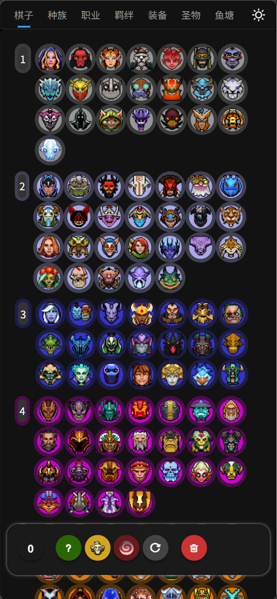
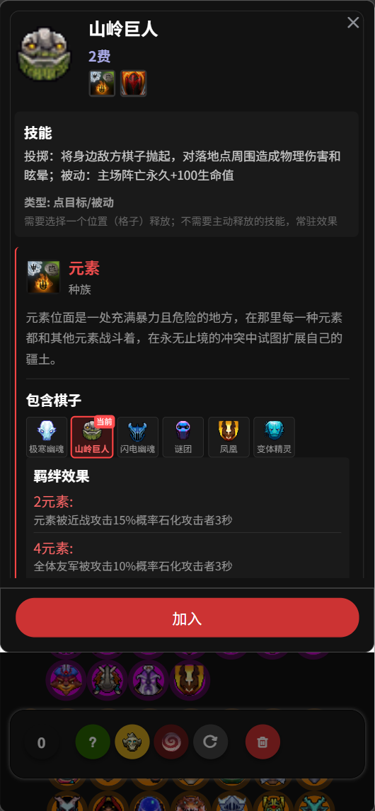
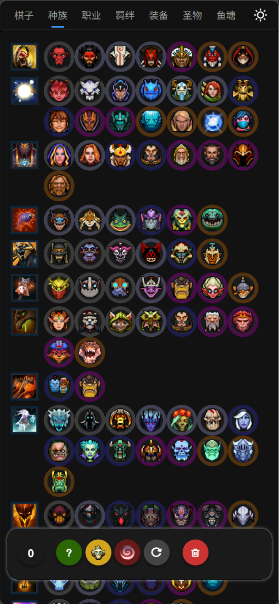
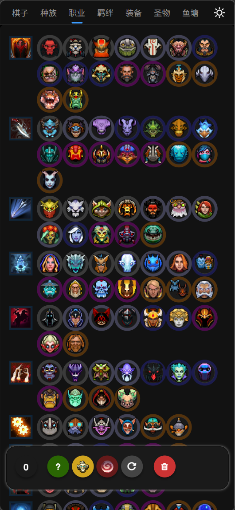
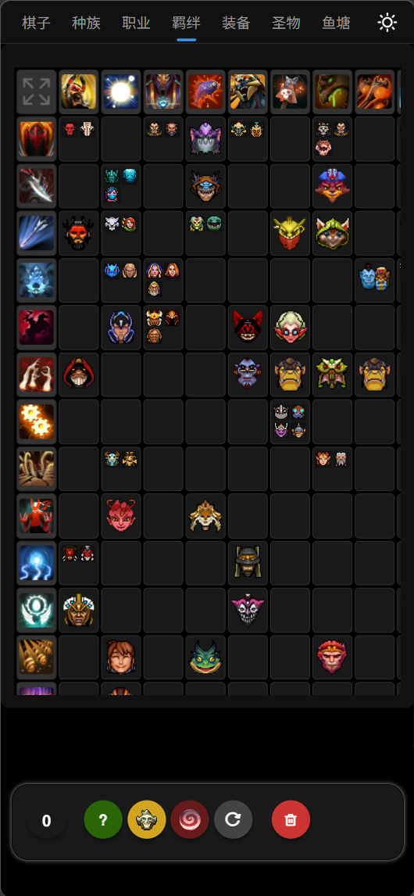
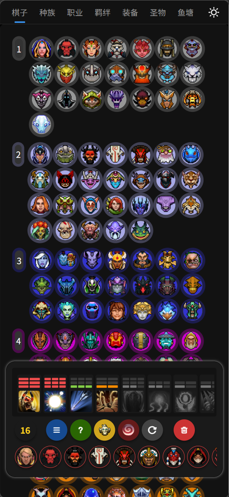
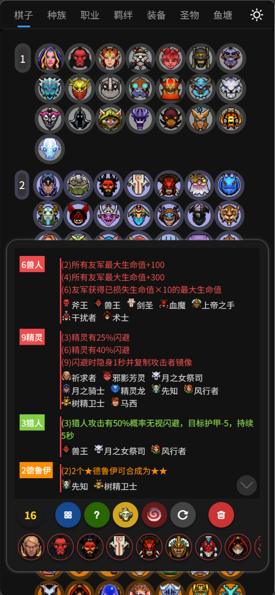
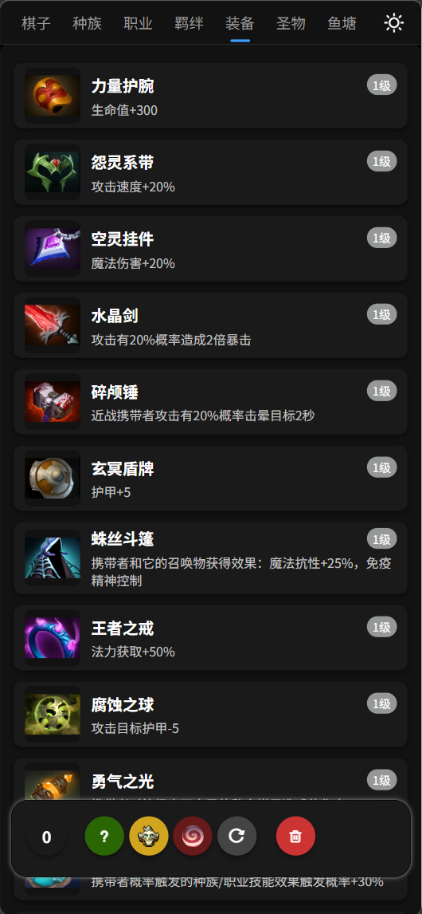
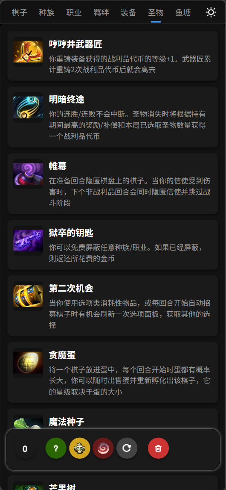
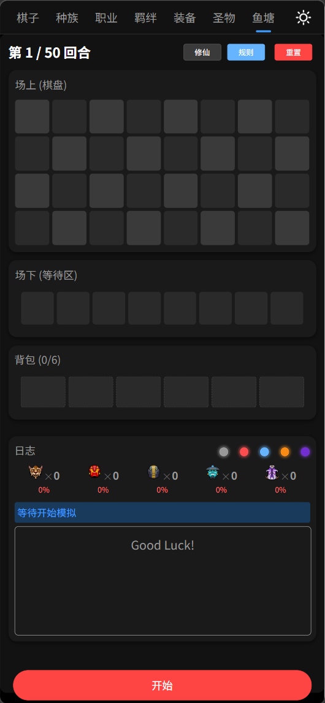

# Dota2 自走棋阵容羁绊查询工具

一个基于 uni-app 开发的 Dota2 自走棋（AutoChess）阵容羁绊查询工具，帮助玩家快速查看棋子信息、羁绊效果和装备数据。

## 项目简介

本项目是一个跨平台的 Dota2 自走棋辅助工具，支持微信小程序、H5、Android 和 iOS 等多个平台。玩家可以方便地查询：

- 🎮 **棋子信息**：查看所有棋子的费用、职业、种族、技能等详细属性
- ⚔️ **羁绊效果**：了解各种羁绊组合及其加成效果
- 🛡️ **装备数据**：浏览游戏内所有装备的属性和效果
- 🎯 **阵容搭配**：快速查找最优阵容组合

## 功能特性

### 1. 棋子浏览
- 完整的棋子信息（100+ 棋子）
- 包含棋子费用、职业、种族
- 详细的技能描述和技能类型
- 棋子头像和图标资源




### 2. 种族羁绊
- 种族羁绊（人类、精灵、兽人等）
- 种族羁绊激活条件和效果说明
- 种族羁绊等级和加成数据



### 3. 职业羁绊
- 职业羁绊（战士、刺客、法师等）
- 职业羁绊激活条件和效果说明
- 职业羁绊等级和加成数据



### 4. 羁绊系统
- 羁绊组合查询
- 羁绊速览和详情面板
- 羁绊加成效果展示



### 5. 选择面板
- 羁绊速览功能
- 羁绊详情查看
- 阵容搭配辅助




### 6. 装备图鉴
- 完整的装备数据库（800+ 装备图标）
- 装备分类和属性展示
- 合成路径查询



### 7. 圣物系统
- 游戏内所有圣物信息
- 圣物效果和获取方式



### 8. 娱乐功能
- 钓鱼模拟器
- 休闲小游戏



## 技术栈

- **前端框架**：uni-app + Vue.js
- **UI 组件**：uView UI 2.0
- **支持平台**：
  - 微信小程序
  - H5 网页
  - Android App
  - iOS App
  - 字节跳动小程序
  - 百度小程序
  - 支付宝小程序

## 项目结构

```
zizouqi/
├── pages/              # 页面文件
│   └── index/          # 主页
│       └── index.vue   # 主页面组件
├── static/             # 静态资源
│   ├── data/           # 数据文件
│   │   ├── chesses.json      # 棋子数据
│   │   ├── fetters.json      # 羁绊数据
│   │   ├── items.json        # 装备数据
│   │   ├── majors.json       # 职业数据
│   │   ├── relic.json        # 遗物数据
│   │   └── skillTypes.json   # 技能类型数据
│   ├── items/         # 装备图标（800+）
│   ├── mini/          # 棋子小图标
│   └── majors/        # 大招图标
├── common/            # 公共文件
│   └── http.js        # 网络请求封装
├── App.vue            # 应用入口
├── main.js            # 主入口文件
├── pages.json         # 页面配置
├── manifest.json      # 应用配置
└── uni.scss           # 全局样式
```

## 快速开始

### 安装依赖

```bash
npm install
```

### 开发运行

#### H5 开发
```bash
npm run dev:h5
```

#### 微信小程序开发
```bash
npm run dev:mp-weixin
```

#### Android 开发
```bash
npm run dev:app-plus
```

### 生产构建

#### 构建 H5
```bash
npm run build:h5
```

#### 构建微信小程序
```bash
npm run build:mp-weixin
```

#### 构建 Android/iOS
```bash
npm run build:app-plus
```

## 数据说明

### 棋子数据结构 (chesses.json)

```json
{
  "id": 1,
  "name": "水晶室女",
  "desc": "冰女",
  "cost": 1,
  "occupation": "4",
  "race": "16",
  "skill": "cm_mana_aura",
  "skill_desc": "奥术光环：周期性的为所有友方棋子充能法力值",
  "skill_type": "光环",
  "icon": "npc_dota_hero_crystal_maiden_png.png",
  "image": "chess_cm_png.png",
  "isuse": 1,
  "sort": 1
}
```

### 羁绊数据结构 (fetters.json)

```json
{
  "id": 1,
  "name": "3战士",
  "majorId": "1",
  "condition": 3,
  "desc": "所有友方战士护甲+3",
  "type": 0
}
```

## 配置说明

### 微信小程序配置

在 `manifest.json` 中配置你的小程序 AppID：

```json
"mp-weixin": {
  "appid": "你的小程序AppID",
  "setting": {
    "urlCheck": true,
    "es6": true,
    "postcss": true,
    "minified": true
  }
}
```

### 字节跳动小程序配置

```json
"mp-toutiao": {
  "appid": "你的字节跳动小程序AppID",
  "setting": {
    "es6": true,
    "postcss": true,
    "minified": true
  }
}
```

## 开发说明

### 依赖版本

- uView UI: ^2.0.38

### 代码规范

- 使用 Vue 2.x 语法
- 遵循 uni-app 开发规范
- 组件命名使用 kebab-case
- 数据绑定使用 v-model

### 注意事项

1. `node_modules`、`unpackage`、`.hbuilderx` 等目录已在 `.gitignore` 中排除
2. 开发时请确保已安装 HBuilderX 编辑器
3. 微信小程序需要配置合法域名
4. 图片资源较多，首次加载可能较慢

## 更新日志

### v1.0.0 (2024-03-27)
- ✨ 初始版本发布
- 🎮 完整的棋子数据库
- ⚔️ 羁绊系统查询
- 🛡️ 装备图鉴功能
- 📱 支持多平台运行

## 数据来源

游戏数据来源于 Dota2 自走棋官方游戏，仅供参考学习使用。

## 许可证

[MIT License](LICENSE)

## 贡献指南

欢迎提交 Issue 和 Pull Request 来帮助改进这个项目！

1. Fork 本仓库
2. 创建特性分支 (`git checkout -b feature/AmazingFeature`)
3. 提交更改 (`git commit -m 'Add some AmazingFeature'`)
4. 推送到分支 (`git push origin feature/AmazingFeature`)
5. 开启 Pull Request

## 联系方式

如有问题或建议，欢迎通过 GitHub Issues 联系。

---

**Made with ❤️ for Dota2 AutoChess Players**
